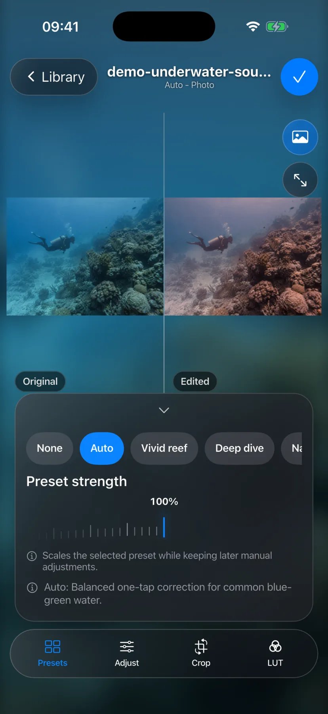
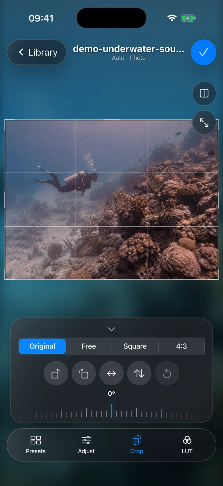
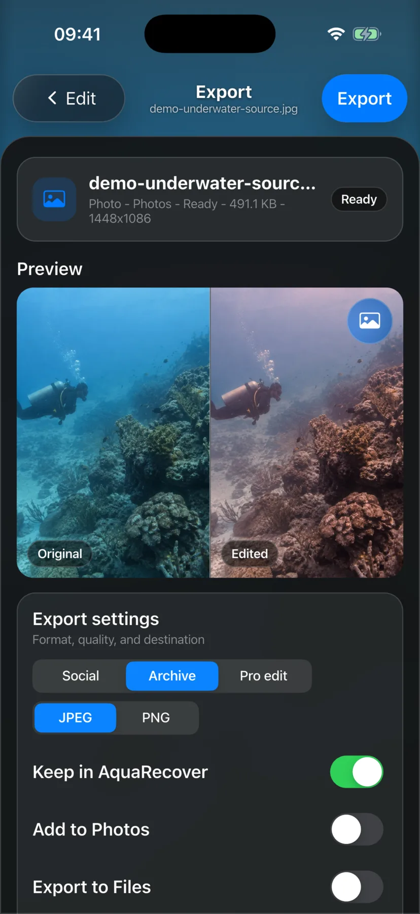

<p align="center">
  
</p>

<h1 align="center">AquaRecover</h1>

<p align="center">
  <strong>An open-source, on-device darkroom for underwater images.</strong><br>
  Recover color, rebuild contrast, inspect every change, and keep the original untouched.
</p>

<p align="center">
  <a href="https://github.com/FinnGrndl/AquaRecover/actions/workflows/ci.yml"></a>
  <a href="https://github.com/FinnGrndl/AquaRecover/releases/latest"></a>
  <a href="LICENSE"></a>
  <a href="https://github.com/FinnGrndl/AquaRecover/releases/latest"></a>
</p>

## Underwater light is the problem

A camera does not see the same scene below the surface that it would see in
air. Water absorbs warm wavelengths first. Reds and oranges disappear with
distance, blue or green begins to dominate, haze lowers local contrast, and
artificial light can produce a completely different color balance a few
centimeters away.

A global white-balance correction can move the whole image toward neutral, but
it cannot describe all of that. Push it too far and open water turns magenta;
hold it back and the diver, reef, or wreck never regains warmth.

AquaRecover treats the photo as an underwater scene rather than a badly chosen
color temperature. It measures channel loss and luminance, estimates how much
warm color can safely return, separates open water from textured subjects, and
rebuilds tone before applying the familiar editing controls. The automatic
result is a starting point, not a locked decision.

Everything happens locally. There is no account, upload queue, analytics SDK,
subscription, or remote processing service.

<p align="center">
  
  
  
</p>

<p align="center"><sub>Real iOS Simulator captures using the repository's synthetic demo image. No third-party dive photo is redistributed.</sub></p>

## From dive to export

```text
Photos or Files
      ↓
scene measurement → bounded color recovery → tone and local contrast
      ↓
preset baseline → manual adjustments → crop / rotate / LUT
      ↓
edited, original, or split comparison
      ↓
Photos, Files, or the local AquaRecover library
```

Select one photo and AquaRecover opens it in the editor as soon as the initial
preview is ready. Select several and the same action becomes a batch: every
item keeps its own edit state, settings can be copied from one frame to selected
or all others, and completed exports leave the queue so they cannot be exported
twice by accident.

Presets describe a complete starting profile. They have their own strength
control and remain the baseline for later edits. Tapping an adjustment value
restores only that control to the value supplied by the preset. The **None**
preset is deliberately neutral and leaves the image unchanged.

The editor keeps comparison close to the image. Switch between edited and
split views, press and hold to reveal the original, fit the complete frame or
fill the preview, and pinch to inspect details. Cropping is nondestructive and
supports fixed or freeform ratios, draggable edges and corners, rotation,
straightening, and flips. A dedicated LUT tab accepts built-in looks and custom
`.cube` files for still images.

Nothing is written when media is imported. Output is created only after export
is confirmed, and each destination is independent:

- add the result to the system Photos library;
- save it to a folder chosen with the system file picker;
- keep it in AquaRecover's local export library;
- or combine those destinations.

Local exports receive a small `.aquarecover.json` sidecar with the edit,
transform, LUT, and export settings. It records file names, not the original
absolute path.

## What happens to a pixel

The default processor is deterministic and inspectable. It does not use a
trained model, invent scene content, or send an image elsewhere.

1. **Measure the scene.** Channel means, robust luminance percentiles, red
   deficit, and the relationship between blue and green describe the cast and
   usable tonal range.
2. **Estimate recoverable warmth.** Red recovery is bounded by scene statistics
   and weighted differently for flat open water and textured subjects. This is
   what keeps a neutral reef from requiring magenta water.
3. **Rebuild tone.** Percentile-based contrast stretch ignores isolated clipped
   pixels. Exposure, gamma, highlights, shadows, and black point then operate on
   a stable range.
4. **Fuse local structure.** A low-resolution illumination guide restores local
   separation without flattening the subject or forcing the background to
   gray.
5. **Finish deliberately.** Color, haze, clarity, sharpening, vignette, crop,
   orientation, and LUT settings are applied from the visible editor state.
   Full-resolution export reruns the pipeline from the original file.

Previews use bounded dimensions and omit the most expensive final detail pass,
so interaction stays responsive. The exported file is never an enlarged copy
of the preview.

The portable implementation lives in
[`underwater_processor.dart`](lib/core/processing/underwater_processor.dart).
iOS also provides Core Image renderers for stills, previews, and video. Tests
keep the portable and native paths measurable as the algorithm evolves.

## Platform scope

| Capability | iOS | macOS | Android | Windows |
| --- | --- | --- | --- | --- |
| JPEG, PNG, and WebP correction | Yes | Yes | Yes | Yes |
| Photos-library import | Native Photos APIs | Native Photos APIs | System media access | — |
| File import and folder export | Yes | Yes | Yes | Yes |
| HEIC/HEIF decode | Native | Native | Platform dependent | Platform dependent |
| Supported RAW still decode | Core Image | Core Image | ImageDecoder on API 28+ | — |
| Standard video export | MP4/MOV via AVFoundation | MP4/MOV with local `ffmpeg` | — | — |
| Custom `.cube` LUT for stills | Yes | Yes | Yes | Yes |

AquaRecover is photo-first. Video support is currently strongest on Apple
platforms, custom LUTs are not supported by the native iOS video path, and
proprietary formats such as Blackmagic RAW, REDCODE RAW, and ProRes RAW are not
implemented.

## Privacy is part of the architecture

The repository contains no login, advertising framework, telemetry client,
upload endpoint, or cloud backend. Selected media is decoded and rendered on
the device. If an item exists only in iCloud, the operating system may download
it before providing AquaRecover with a local file.

Still exports are freshly encoded. Video exports remove metadata by default.
The iOS and macOS privacy manifests declare no tracking and no collected data.
The complete data flow is documented in the [privacy policy](PRIVACY.md) and
[on-device privacy model](docs/ON_DEVICE_PRIVACY.md).

## Try AquaRecover

The [latest GitHub release](https://github.com/FinnGrndl/AquaRecover/releases/latest)
contains the Android APK, Windows installer, and signed macOS disk image. iOS
builds are distributed through TestFlight while store preparation is in
progress.

Current source version: `1.3.2+14`.

To run from source with the same Flutter toolchain used by CI:

```bash
git clone https://github.com/FinnGrndl/AquaRecover.git
cd AquaRecover
flutter pub get
flutter run -d macos
```

Use `flutter devices` to choose another connected target. The
[development guide](docs/DEVELOPMENT.md) covers the complete setup for Flutter,
Xcode, iOS Simulator test media, physical Apple devices, Android, Windows,
release builds, the simulator harness, tests, and common permission problems.

## Build, study, or improve it

This project is useful at several levels: as an underwater editor, as a readable
color-restoration pipeline, and as a Flutter application that crosses into
PhotoKit, Core Image, AVFoundation, platform file pickers, and desktop
packaging without introducing a backend.

```text
lib/core/processing/        restoration, transforms, LUTs, image/video services
lib/core/photo/             photo-library permission and asset access
lib/core/persistence/       export paths and versioned sidecars
lib/features/editor/        editor, queue, crop, compare, and export workflow
ios/ and macos/             native Apple runners and processing bridges
android/ and windows/       desktop/mobile platform runners
platform_overrides/         native files retained during project regeneration
test/                       unit, widget, metadata, and regression tests
tool/                       evaluator, benchmark, tuner, and simulator harness
```

Start with:

- [Building and running AquaRecover](docs/DEVELOPMENT.md)
- [Architecture](docs/ARCHITECTURE.md)
- [Contributing](CONTRIBUTING.md)
- [Release automation](docs/RELEASE_AUTOMATION.md)
- [Security policy](SECURITY.md)

Algorithm changes should include a focused test. Private reference images can
be placed in the ignored `test/img` directory for local evaluation, but must
never be committed unless you own the necessary redistribution rights.

## License

AquaRecover is available under the [MIT License](LICENSE). Dependency licenses
are listed in [THIRD_PARTY_NOTICES.md](THIRD_PARTY_NOTICES.md) and inside the
app under **About > Licenses**.
