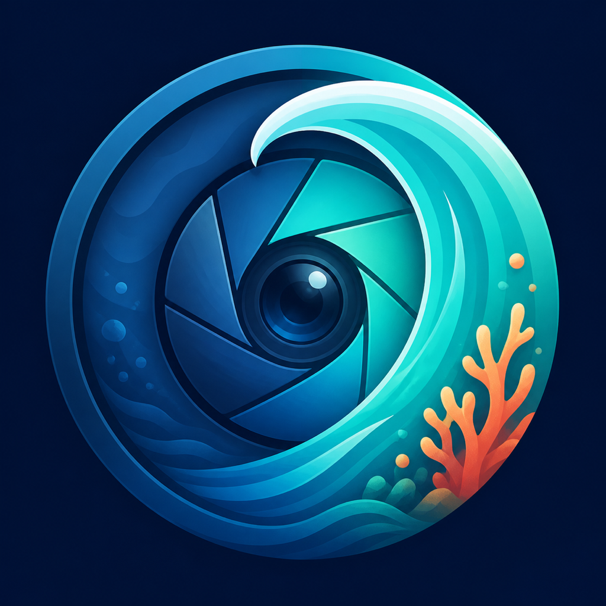

<p align="center">
  
</p>

# AquaRecover

AquaRecover corrects the color and contrast of underwater photos on the device.
It is written in Flutter, uses native Apple media APIs where they are useful,
and does not require an account or a processing server.

Version 0.4.0 is the first open-source release candidate. The photo workflow is
usable on iOS, macOS, and Android; video and RAW support vary by platform as
described below.

## How the app behaves

- Selecting one image opens the editor after the initial preview is ready.
- Selecting several images creates one batch automatically. No output file is
  written until an export action is confirmed in the export view.
- The currently selected batch item can be exported on its own. A later
  `Export all` processes the remaining ready or failed items. Every successful
  export is removed from the queue immediately, preventing accidental duplicate
  exports.
- The selection overview shows every queued item and lets unprocessed items be
  removed without deleting the original file.
- Local exports can be opened, selected in batches, or deleted all at once.
  Deleting them also removes their settings sidecars, but never imported
  originals or copies already added to Photos.
- Every image adjustment remains visible in the editor and can be changed before
  a single-image export.
- On iOS, selection uses the system Photos picker. Saving an export to Photos
  requests add-only access instead of access to the complete library.
- Files can be imported directly. When the local destination is selected,
  exports remain available in the app's Documents directory and receive an
  `.aquarecover.json` settings sidecar.
- Export destinations are independent: keep a local AquaRecover copy, add the
  result to the device Photos library, copy it to a folder selected through the
  system file picker, or combine those destinations. Photos and Files exports
  do not remain in the local library unless its destination is also enabled.

## How image restoration works

The default correction is deterministic. It does not call a remote service and
does not use a trained model.

### 1. Measure the scene

The processor samples channel means, luminance percentiles, red loss, and the
relationship between blue and green. These measurements distinguish a dark
blue scene from shallow cyan or green water and keep the automatic correction
within fixed bounds.

### 2. Recover attenuated color

Water removes warm wavelengths first. AquaRecover estimates the red deficit
from the green and blue channels and restores part of it. Flat open water is
treated differently from textured subjects, which reduces red or magenta water
while allowing coral, skin, equipment, and other material to regain warmth.

### 3. Balance tone and color

A bounded gray-world balance corrects the overall cast. Robust low and high
luminance percentiles drive the contrast stretch, so a few clipped pixels do
not set the range for the entire image. Exposure, gamma, highlights, shadows,
black point, saturation, vibrance, and hue are then applied from the current
editor values.

### 4. Preserve local structure

A low-resolution local illumination guide is blended with the global result.
The blend uses texture, color deficit, and open-water estimates to avoid
flattening subjects or turning the background neutral. Export rendering ends
with optional clarity and sharpening; previews skip that expensive final pass.

### 5. Encode and record the edit

The result is written as JPEG or PNG. The sidecar stores the chosen settings,
crop and orientation, export options, LUT, trim values, and source/output
names. It does not store the full source path.

The portable implementation is in
[`underwater_processor.dart`](lib/core/processing/underwater_processor.dart).
iOS also has a Core Image renderer for full-resolution stills and previews.
Reference-pair tests keep both paths and later tuning measurable.

## Editing controls

The editor provides presets plus controls for water correction, red recovery,
white balance, contrast stretch, contrast, gamma, brightness, exposure,
highlights, shadows, black point, saturation, vibrance, hue, highlight
protection, haze reduction, clarity, sharpness, vignette, and JPEG quality.

Built-in presets cover natural correction, vivid reefs, deep scenes, shallow
and green water, macro, red-filter footage, and artificial light. **None** uses
neutral values and leaves the image unchanged. A `.cube` LUT can also be
applied to still images.

A preset supplies the starting values for all nineteen adjustments. Its
strength can be reduced without discarding later manual changes. Individual
adjustments keep the selected preset as their base; tapping a value bubble
restores only that value to the preset baseline. **Water correction** controls
the underwater cast-recovery stage but does not scale exposure, contrast,
saturation, or sharpening.

The preview button switches between the edited image and a side-by-side split.
The adjacent view button switches between fitting the complete image and
filling the preview area. Outside the Crop tab, a two-finger pinch zooms the
preview for detail inspection and a double-tap resets that view. Pressing and
holding the normal edited preview temporarily shows the original. The Crop tab
applies a nondestructive crop, 90-degree rotation, horizontal or vertical flip,
and its own pinch positioning. Original, square, 4:3, and 16:9 aspect ratios are
available; portrait media keeps the corresponding portrait orientation. LUT
selection and intensity live in the dedicated **LUT** tab.

## Platform support

| Capability | iOS | macOS | Android |
| --- | --- | --- | --- |
| JPEG/PNG/WebP photo correction | Yes | Yes | Yes |
| System photo-library import | Native picker | Local browser | Local browser |
| HEIC/HEIF decode | Native | Native | Platform dependent |
| Supported RAW still decode | Core Image | Core Image | ImageDecoder on API 28+ |
| Standard video export | AVFoundation/Core Image | Requires local `ffmpeg` | Not available |
| Raw frame-stream export | No | Requires local `ffmpeg` | No |

The first store release should be treated as photo-first. Custom `.cube` LUTs
are not supported by the native iOS video path. Proprietary formats such as
Blackmagic RAW, REDCODE RAW, and ProRes RAW are not implemented.

## Privacy

Processing stays on the device. App code contains no login, analytics client,
advertising SDK, upload endpoint, or cloud-processing backend. If a selected
Photos item exists only in iCloud, the operating system may download it before
handing a local file to AquaRecover.

Still exports are freshly encoded and video exports strip metadata by default.
The iOS and macOS privacy manifests declare no tracking and no collected data.
Read the [privacy policy](PRIVACY.md) and
[technical privacy model](docs/ON_DEVICE_PRIVACY.md) for the complete data flow.

## Build from source

The checked release environment uses Flutter 3.44.1 and Dart 3.12.1. Start with
a current stable Flutter installation:

```bash
flutter --version
flutter doctor -v
flutter pub get
```

Run the app on an available target:

```bash
flutter run -d macos
flutter run -d <ios-simulator-id>
flutter run -d <android-device-id>
```

The committed platform projects use the application identifier
`io.github.finngrndl.aquarecover`. Apple device and archive builds require your
own development team. Android store builds require an upload key kept outside
the repository.

`scripts/bootstrap_flutter_project.sh` is only needed when regenerating the
platform folders. It preserves the native bridges and accepts an alternate
identifier:

```bash
AQUA_ORG=com.yourname AQUA_APP_ID=com.yourname.aquarecover \
  ./scripts/bootstrap_flutter_project.sh
```

## Checks

```bash
dart format --output=none --set-exit-if-changed lib test tool
flutter analyze
flutter test
```

The evaluator and benchmark use optional private media that is not distributed
with the repository. After restoring `test/img` locally, run:

```bash
dart run tool/evaluate_samples.dart
dart run tool/benchmark_processor.dart
```

For Apple build validation:

```bash
flutter build ios --simulator --debug --no-pub
flutter build ios --release --no-codesign --no-pub
flutter build macos --debug --no-pub
```

GitHub Actions runs formatting, analysis, tests, an Android debug build, and
Apple debug builds for pushes and pull requests. Standard hosted runners do not
add a charge while the repository is public.

## Local reference images

`test/img` is ignored by Git. It can contain private before/after pairs and large
camera files for local evaluation, but none of those files belong in commits,
CI artifacts, or releases. See
[Local test media](docs/LOCAL_TEST_MEDIA.md) for the expected layout.

## Repository layout

```text
lib/core/                    media, models, processing, persistence, platform bridges
lib/features/editor/         Cupertino editor and import/export workflow
ios/ macos/ android/         platform runners
platform_overrides/          native files restored by the bootstrap script
assets/branding/             canonical app icon shared by every platform
test/                        unit, widget, and processor regression tests
tool/                        optional local evaluator, tuner, benchmark, simulator harness
docs/                        architecture, privacy, audit, and release notes
```

More detail is available in [Architecture](docs/ARCHITECTURE.md),
[Security review](docs/BUG_SECURITY_AUDIT.md), and the
[release checklist](docs/RELEASE_CHECKLIST.md).

## Contributing and support

Read [CONTRIBUTING.md](CONTRIBUTING.md) before opening a pull request. Use the
issue forms for bugs and focused feature requests. Vulnerabilities should be
reported privately as described in [SECURITY.md](SECURITY.md).

The source code and documentation are available under the [MIT License](LICENSE).
Private test image fixtures are not part of the repository. Dependency licenses
are listed in [THIRD_PARTY_NOTICES.md](THIRD_PARTY_NOTICES.md) and in the app
under **About > Licenses**.
